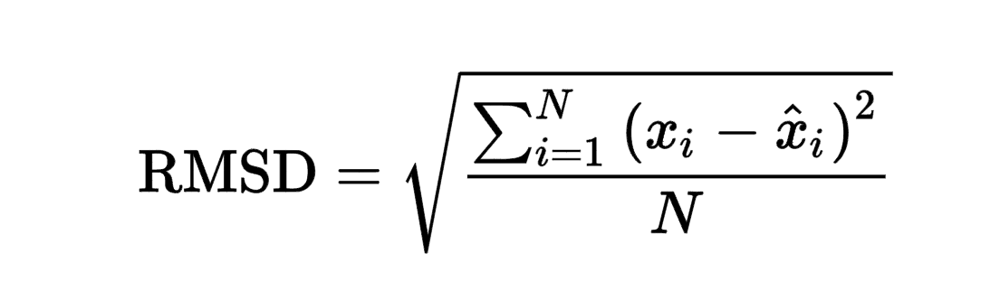

# Soccer Transfer Market Application

Project by [Bofei He](https://www.linkedin.com/in/bofei-tony-he/)

# Table of Contents
- Introduction
- Obtaining Data & Cleaning
- Value Model Training and Testing
- Player Performance Projection
- Recommendation System
- Streamlit App
- Contributor

# Introduction
The football industry has experienced an unprecedented surge in revenue, driven by lucrative sponsorship deals, TV broadcasting contracts, and substantial investments from affluent team owners. Consequently, the soccer transfer market has witnessed an astronomical inflation of player valuations over the past decade. However, the year 2023 proved to be a defining moment when the Saudi Arabian League clubs made headlines by surpassing all prior records with astonishing offers. Among these was a groundbreaking proposal to Kylian Mbappe, a renowned football sensation, with an audacious reported annual salary of £700 million. This remarkable transfer not only set a new benchmark for player valuations but also triggered a paradigm shift, reshaping the dynamics of the entire market.

Amidst this backdrop of financial extravagance and soaring player prices, there arises an imperative for innovative solutions to navigate this ever-evolving soccer transfer landscape effectively. In response to these challenges and opportunities, we embarked on the development of a pioneering Soccer Transfer Market Application. This application aims to revolutionize how clubs, agents, and football enthusiasts interact with player data. Through this report, we delve into the design, development, and key functionalities of our Soccer Transfer Market Application, shedding light on the methodologies utilized in its creation. We aim to provide valuable insights into the transformative soccer transfer landscape, underscoring the significance of data-driven decision-making in this hypercompetitive domain, ultimately empowering stakeholders to make more informed and strategic player transfer decisions.

# Obtaining Data

In this project, two sources of data was scraped and used:
- [FBREF](https://fbref.com/en/) - Detailed on-feild statistics of player performance
- [Transfermarkt](https://www.transfermarkt.co.uk/) - Information regarding player transfer values

# [FBREF](https://fbref.com/en/)

FBREF is a widely popular website offering comprehensive statistical data for football matches, leagues, and players from various competitions worldwide. With an extensive database covering major domestic leagues, international tournaments, and continental games, FBREF provides in-depth player and team statistics, including goals, assists, shots, passes, tackles, interceptions, and advanced metrics like expected goals (xG) and expected assists (xA).

While the website does consist of data for player performances from many leagues across the globe, the leagues that had the most comprehensive data were the Premier League, La liga, Serie A, Bundesliga, Ligue 1, Liga Portugal, Eredivisie, Süper Lig, and Jupiler Pro League. Hence, I will be gathering data from each of the 9 leagues over the 2022-2023 season.

For each league, there are 10 different datasets measuring various facets of a player;s game. The datasets are named as follows:
- Standard Stats
- Goalkeeping
- Advanced Goalkeeping
- Shooting
- Passing
- Pass Types
- Goal and Shot Creation
- Defensive Actions
- Possession
- Miscellaneous Stats

Given that Goalkeepers are judged based on entirely different metrics when compared to outfield players, I decided to not include goalkeepers in this project. Therefore, the two datasets related to Goalkeeper performance will not be scraped.

Below is an overview of the remaining datasets:
- Standard Stats: As its name implies, this dataset consists of standard information about each player’s age, playing time and other basic information like goals scored and assisted, expected goals and assists, number of yellow/red cards etc.

- Shooting: Information regarding players’ shots from a quantitative as well as qualitative standpoint.

- Passing: Information regarding the quantity and quality of passes cumulatively as well as separated into sections based on pass distance (i.e. Short, Medium and Long distances)

- Pass Types: Information regarding the type of passes attempted and their respective outcomes (i.e. aerial/medium-level/ground level height and body part used to make the pass). In order to limit an already high number of features to use; this dataset was not utilized as it was decided based on domain knowledge that the body parts used by a player to make a pass or the height at which players make passes are unlikely to be a major determinant of a player’s price.

- Goal and Shot Creation: Information regarding players’ actions that have led to shot taking opportunities and goals.

- Defensive Actions: Information regarding the defensive aspects of a player’s game and also information about how their defensive efforts contributed to the team winning the ball back and creating a goal-scoring opportunity for the team as a result.

- Possession: Information regarding the player’s ability to progress the ball and impact the proceedings of the game.

- Miscellaneous Stats: Miscellaneous on-field performance information such as number of direct red cards, second yellow cards, fouls committed/drawn, offsides etc.

## Scraping FBREF
Since the website no longer supports an easy option to download the data, I implemented two functions with the Beautiful Soup library that allows me to scrape data automatically(See Notebook). The first function is called get_league_links(). When given the link of each league’s page, It locates and returns the link of each individual team in that league. Then, I implemented the scrape_players() function. This function iterates through each team’s link to locate and scrape out every player’s name and statistics from each of the tables highlighted above. After each league’s link was scraped, I combined and exported them into one csv file.

# [Transfermarkt](https://www.transfermarkt.co.uk/)

Transfermarkt is a prominent online platform for football enthusiasts, offering a comprehensive database of transfer news, player valuations, statistics, and market trends. Founded in Germany in 2000, it has become one of the largest football databases globally, providing estimated market values for players, up-to-date transfer news and rumors, detailed player and club profiles, market value development tracking, transfer history, and national team statistics. Transfermarkt serves as an invaluable resource for football fans, clubs, agents, and journalists seeking insights into player values, transfer activities, and the latest happenings in the footballing world.

The information that I gathered from this website are:
- Player Name
- Current Team
- Age
- Position
- Market Value 2023
- Market Value 2022

I gathered two transfer values because the statistics of the 2022-2023 season can only determine how much that value has changed since 2022. The value in 2022 is determined from the player’s performance in previous years.

## Scraping Transfermarkt
Similar to FBREF, the website doesn’t support a download option. Therefore, I implemented some functions with the Beautiful Soup library that allows me to scrape data automatically(See Notebook). The first function is team_names(). This allows me to find the name of each team that’s in each league. Next, using the function team_links(). From the names of each team in a specific league, I was able to get a list of links for these teams. Finally, the function build_df. This function iterates through the links of each team to find and scrape every single player(on that team) and their desired statistics. This process was applied to each league as well as both 2023 and 2022. However in 2022, I only scraped the player names and market values. After scraping, I combined every league’s dataframe and changed the data type of player market values from object to integer. Then,  I subtracted each player’s 2022 market values from their 2023 dataset’s market values to create the final dataset for Transfermarkt.

# Cleaning([Notebook](https://github.com/Chickychicken/Soccer-Transfer-Market-Application/tree/main/Cleaning))

Before combining the player statistics from FBREF and Transfermarkt, I had to fix some issues and formats. First, I used the unicode encoder to remove all special characters in players’ names. After that, I noticed that on FBREF, the player’s last name was listed first, and first name was listed second. I had to swap every single player’s first and last name. Then I checked for duplicated names and dropped every single duplicated player names. For the players that played on two different teams in one season. I kept the row that played the most games and dropped the other. Finally, I combined the two datasets and obtained my final dataset. Phew!

## Scraping and Cleaning Improvements
Some improve in scraping and cleaning include:
- Many players were bought from smaller leagues during this period. In addition, many players left bigger leagues. So I lost some data points because of this. Next time, I think I should scrape every single player in 2023 and scrape each of those players’ market value by iterating through their names instead of scraping with team links.
- Combining the stats and matches played for duplicated players. This is hard to do because some stats are per 90 minutes or percentages so I have to recompute these stats from other stats.

# Market Value Model Training and Testing

## Workflow
Given my assumption that player values are likely determined by different attributes based on their playing position, a model was built for each of the 3 positions: attackers, midfielder and defenders. In each notebook, it can be seen that a modeling workflow to predict transfer values was first created for the attacking players’ dataset. Once a workflow had been established, the same process of modeling steps and printing results was repeated for midfielders and defenders.

## Models
Five different models were used to help predict players’ change in transfer values. In each model, the models were first used with their default hyperparameters. The first modeling attempt in each workflow would use the features that are most related to the players’ positions. For example, attackers include goals, shots on target, goal creating actions, and etc. Midfielders include pass completion, assists, total passing distances, and etc. Defenders include interceptions, clearances, tackles, and etc. However, all of these player groups have some attributes in common. These are age and matches played. Once the initial model was run, a second model was run by transforming and removing some variables to avoid collinearity. For transformation, I used the power transformer. For removing variables, I checked the variance inflation factor(VIF) which is a statistical measure used in regression analysis to assess multicollinearity between predictor variables. After that, I conducted a grid search with some hyperparameter tuning to find the best parameters. Finally, the model was fitted with these hyperparameters. To evaluate my model’s performance, Root Mean Square Deviation(RMSD) or Root Mean Square Error(RMSE) was calculated. RMSE is a common metric used to evaluate the performance of a predictive model. It is a measure of the differences between predicted values and actual (observed) values in a dataset. It calculates the square root of the average of the squared differences between predicted and actual values. 

A lower RMSE indicates that the model's predictions are closer to the actual values, signifying better performance. Conversely, a higher RMSE suggests that the model's predictions deviate more from the actual values, indicating poorer performance.

Here is a list of the models that I used:

Decision Trees Regression:

- Easy to interpret and handle non-linearity well
- Prone to overfitting

Random Forest Regression:
- Improved accuracy since it combines multiple decision trees
- Understanding the exact reasoning behind each prediction is challenging

Gradient Boost:
- Combines predictions of weak learners that reduce bias and variance to improve model performance
- Finding the right combination of hyperparameters can be challenging, and different sets of hyperparameters may result in significantly different model performances

ElasticNet Regression:
- Combines strengths of Lasso and Ridge regression to handle high-dimensional datasets
    - Lasso helps removes irrelevant features
    - Ridge helps reduce the impact of multicollinearity among features
- Improper hyperparameter tuning may lead to suboptimal results, with the model not fully exploiting the benefits of both L1 and L2 regularization

Support Vector Regression:
- Robust to outliers since it finds hyperplane that best first the majority of data
- Model is very complex and it’s time consuming to find the optimal parameters

Below are the performance of each model for each positions:

Decision Tree Regression([Notebook](https://github.com/Chickychicken/Soccer-Transfer-Market-Application/blob/main/Model%20Building/Decision_Tree.ipynb))

Random Forest Regression([Notebook](https://github.com/Chickychicken/Soccer-Transfer-Market-Application/blob/main/Model%20Building/Random_Forest.ipynb))

Gradient Boost Regression([Notebook](https://github.com/Chickychicken/Soccer-Transfer-Market-Application/blob/main/Model%20Building/Gradient_Boost.ipynb))

Elastic Net Regression([Notebook](https://github.com/Chickychicken/Soccer-Transfer-Market-Application/blob/main/Model%20Building/ElasticNet_Regression.ipynb))

Support Vector Regression([Notebook](https://github.com/Chickychicken/Soccer-Transfer-Market-Application/blob/main/Model%20Building/Support_Vector.ipynb))

## Model Evaluation([Notebook](https://github.com/Chickychicken/Soccer-Transfer-Market-Application/blob/main/Model%20Building/Model_Comparison.ipynb))
Having concluded modeling for this part of the project, the results for each model were compared to identify which model worked best to predict players’ change in transfer values with the lowest RMSE for each position.

Random Forest produced the lowest RMSE for attackers

ElasticNet produced the lowest RMSE for midfielders

Random Forest produced the lowest RMSE for defenders

Final result

My models have an error of around 6 - 10 million euros. Although defenders’ RMSE is the lowest, defenders are cheaper compared to attackers and midfielders so therefore my models’ performances are around the same regardless of position.

As for the attributes that determines the players’ change in price the most, here are the top 3 for each position:
Attackers:
- Age
- Goal Creating Actions
- Shots on Target %

Midfielders:
- Age
- Total Passing Distance
- Goals

Defenders:
- Age
- Progressive Passing Distance
- Successful Challenge %

For all 3 positions, age approximately doubles the second highest attribute. This means that age is the biggest factor when it comes to predicting how much a player’s market transfer value has changed.

## Model testing([Notebook](https://github.com/Chickychicken/Soccer-Transfer-Market-Application/blob/main/Model%20Building/model_testing.ipynb))
I generated 10 random players from each of the 3 positions to see how their predicted values compare to their actual values. The results are solid.

Attackers

Midfielders

Defenders

The results are surprisingly good, especially for defenders! For the players that the predicted value deviates by more than 5 million, they are worth substantially more than the rest of the players to begin with. Since they have higher values to begin with, they have a higher bar on their performance. They are the best among the best so a bad season for them is still better than a good season for the average players. In addition, the model evaluates everyone’s performance the same. This explains why Mo Salah’s value is off by almost 25 million.

## Conclusion
Age stands out as the most crucial factor when predicting the change in transfer value across all positions. For attackers and defenders, the Random Forest regression model proves to be the most effective in accurately forecasting value fluctuations. On the other hand, when it comes to midfielders, the ElasticNet model outperforms others in predicting their value changes.

Overall, these models demonstrate decent accuracy in projecting value shifts for the majority of players. However, they may encounter challenges when dealing with star players or big names. This can be attributed to the high expectations people have for these players due to their stellar past performances. As a result, the models might not perform as well in capturing the nuances of value changes for these top-tier athletes.

## Model Improvements
Although the models did a decent job at predicting the awards, there are many drawbacks:

1. The assumption that all leagues in the competition are equally competitive is not true. This can be fixed by building a model for each league separated by positions. To gather enough data for thorough analysis to achieve this, it is essential to gather player data from multiple seasons, spanning at least five years, for each league.

2. In the modern game, player positions are not divided into only 3 categories, there are a diverse set of player roles within each position, so data will need to be divided to factor this in. This also means a lot more data must be scraped.

3. Difference in performance standard for average and star players. This can be fixed by including the current transfer value of the players. A higher transfer value should mean higher performance standard while a lower transfer value should mean lower performance standard.

4. Variable selection in this analysis focuses solely on the statistics that are relevant to each player's specific position. When reducing collinearity, the attributes being removed are the ones that are highly correlated with each other. This can be optimized in a more rigorous way by applying principal component analysis.

5. Media Influence also plays a part. If a player is on a mainstream team or is hyped up to become the next GOAT, they are more likely to be over valued. This is hard to be factored in as the model only looks at the numbers. One potential way is to create a new column called popularity that uses sentiment analysis of top soccer news sites to evaluate a popularity score of each player.

### What’s next?

Although the model performed well, it can definitely be improved to perform at a higher level. One major obstacle that I need to pass is data scraping. The more data that I have, the more accurate my models are and the more options I have in terms of grouping players. Therefore, the first step of improvement is to develop a more efficient way to scrape data from FBREF and Transfermarkt.

# Player Performance Projection([Notebook](https://github.com/Chickychicken/Soccer-Transfer-Market-Application/blob/main/Similarity%20Model/attribute_evaluation.ipynb))

To simplify the recommendation model, I have decided to summarize player’s statistics into 5 different performance values. They are: Shooting, Passing, Dribbling, Defending, and Physical.

To develop a mathematical model that effectively evaluates the players’ performance, I combined personal knowledge, expert evaluation methods, and the reference of how Fifa made their ratings.

The different statistics are first scaled from 0 to 99 then each stats is computed as the following:
- Shooting = 0.30*Shots On Target / Matches Played + 0.45*Goals / Matches Played + 0.15*Goals Per Shot + 0.05*Penalties Made / Matches Played + 0.05*'Shots From Freekicks / Matches Played

- Passing = 0.45*Assists / Matches Played + 0.05*Passes Completed / Matches Played + 0.025*'Progressive Passing Distance / Matches Played + 0.025*Total Passing Distance / Matches Played + 0.45*Shot-Creating Actions/90

- Dribbling = 0.40*SCA Take-ons / Matches Played + 0.40*Goal Take-ons / Matches Played + 0.10*Shot-Creating Actions/90 + 0.10*Goal-Creating Actions/90

- Defending = 0.20*Successful Challenge %*Challenges / Matches Played + 0.20*Tackles Won / Matches Played + 0.20*Interceptions / Matches Played + 0.15*Clearances / Matches Played + 0.20*Blocks / Matches Played - 0.05*Errors / Matches Played

- Physical = 0.20*Yellow Cards / Matches Played + 0.20*Red Cards / Matches Played + 0.20*Tackles / Matches Played + 0.20*Challenges / Matches Played + 0.10*SCA Defense / Matches Played + 0.10*Goal Defense / Matches Played

Afterwards, I factored in the matches played to ensure players’ who played more matches would rank higher than players who played few matches but did well in all of them. Matches played are worth 40%.

- Shooting = 0.40*Matches Played + 0.60*Shooting
- Passing = 0.40*Matches Played + 0.60*Passing
- Dribbling = 0.40*Matches Played + 0.60*Dribbling
- Defending = 0.40*Matches Played + 0.60*Defending
- Physical = 0.40*Matches Played + 0.60*Physical

Finally, I scaled all performance values from 0 to 99 to get the initial performance ratings.

From then, after looking and evaluating many players’ ratings, I noticed that defenders’ ratings needed adjustments. I decided to scale defenders’ shooting by 0.80, dribbling by 0.90, passing by 1.05, physical by +20 if less than 75 and greater 50, and physical by +45 if less than 50. I also scaled midfielders’ passing by 1.03.

From that, I added league weights to boost higher competitive leagues’ defenders since they generally have lower defense and pass ratings since they are facing stronger attackers. The leagues I scaled are the five big leagues. Premier League, La Liga, Serie A, Bundesliga, and Ligue 1. For defense ratings lower than 70 but greater than 50, I scaled them by +20. If defense ratings are less than 50, I scaled them by +48. For pass ratings, lower than 70 but greater than 50, I scaled them by +10. If pass ratings are lower than 50, I scaled them by +35.

Interestingly, many of my players’ stats are really similar to their fifa ratings. Most ratings are off between 5 - 10 with some being very close 0-5 and some 10 - 15. For example, here is the Fifa 23 comparison to some of the most popular soccer stars right now.

### Attackers:
Erling Haaland, Kylian Mbappe, Robert Lewandowski
   
My projections:
- Haaland: Shooting 95.93, Passing 65.11, Dribbling 84.18, Defending 41.95, Physical 88.06
- Mbappe: Shooting 90.13, Passing 77.61, Dribbling 91.75, Defending 42.61, Physical 85.70
- Lewandowski: Shooting 88.15, Passing 67.05, Dribbling 83.74, Defending 45.48, Physical 86.29

### Midfielders:
Jude Bellingham, Kevin De Bruyne, Jamal Musiala
	  	     
My projections:
- Bellingham: Shooting 75.36, Passing 72.96, Dribbling 83.03, Defending, 72.51, Physical 81.05
- De Bruyne: Shooting 77.40, Passing 92.16, Dribbling 89.73, Defending 45.85, Physical 81.1
- Musiala: Shooting 83.75, Passing 81.57, Dribbling 90.51, Defending 46.78, Physical 84.02

### Defenders:
Ruben Dias, Eder Militao, Virgil Van Dijk
		     
My projections:
- Dias: Shooting 45.17, Passing 78.94, Dribbling 52.2, Defending 91.94, Physical 85.45
- Militao: Shooting 67.73, Passing 79.91, Dribbling 66.71, Defending	 89.91, Physical 84.07
- Van Dijk: Shooting 60.55, Passing 79.14, Dribbling 64.54, Defending 92.14, Physical 80.76

For more player statistics, check out my streamlit app here.

## Projection Improvements
1. Scaling each league’s players individually and then adding the coefficient of the competitiveness of each league. Right now, I don’t have enough data points to make this technique effective. I could expand the dataset by improving my scraper to include players from more leagues.
2. The players in the dataset determine how the scalar works. If the dataset were to be changed, the entire project would end up different. I should select at least 60 players for each league(20 attackers, 20 midfielders, 20 defenders) that effectively represent high performance, low performance and mid performance for each position in each league.
3. Collaborate with soccer experts/analysts for a better coefficient determination as well as taking more performance stats into account

# Recommendation Model([Notebook](https://github.com/Chickychicken/Soccer-Transfer-Market-Application/blob/main/Similarity%20Model/similarity.ipynb))

I approached this model by finding the similarities between performance vectors. Since I have 5 different performance ratings, each player’s ratings will be graphed into a vector in the 5D plane. To determine how similar the factors are, I used k-Nearest Neighbors’ Euclidean distance and cosine similarity metrics.

## Euclidean Distance
Formula:
	
What it does:

Since euclidean distance finds the closeness of neighboring points, it determines how similar the players’ ratings are to one another. This means that the most similar player(s) will be the players at the most similar performance level.

Usage:

The player that has similar performance with Erling Haaland is Alvaro Morata. This is accurate because Morata is currently being wanted by [Inter Milan, AS Roma, AC Milan and Juventus (July 2023)](https://football-italia.net/inter-roma-milan-and-juve-target-morata-offered-new-atleti-deal/). All big clubs.

## Cosine Similarity
Formula:

What it does:

Since cosine similarity measures how aligned the directions of neighboring points are, it determines how similar the players' rating’s distributions are with one another. This means that the most similar player(s) will be the players with the most similar playstyle.

Usage:

The player that has a similar playstyle with Robert Lewandowski is Dusan Vlahovic. This is accurate because Lewandowski’s former club, Bayern Munich, [is keeping Vlahovic as a potential Lewandowski replacement(July 2023)](https://footballtoday.com/2023/07/15/bayern-munich-keeping-tabs-on-dusan-vlahovic/). Showing that like Lewandowski, Vlahovic also fits Bayern’s playing scheme.

### Fun Prediction
Here is who I predict will become the next Ronaldo

Kevin Paredes! 

[He is USMNT’s new teenage star!](https://www.goal.com/en-us/news/usmnt-new-teenage-bundesliga-star-his-name-kevin-paredes/blt0eca19a1b39b717d) 

20 Years Old Left Mid!

# StreamLit App
UNDER CONSTRUCTION

# Contributor
## Bofei He

### LinkedIn: https://www.linkedin.com/in/bofei-tony-he/
### Github: https://github.com/Chickychicken
### Email: hbofei@gmail.com